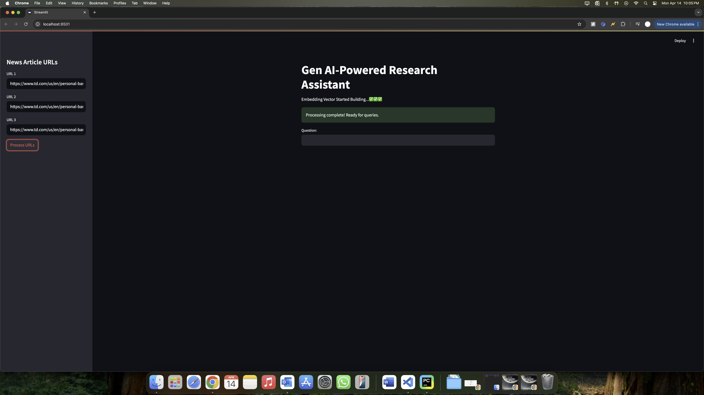
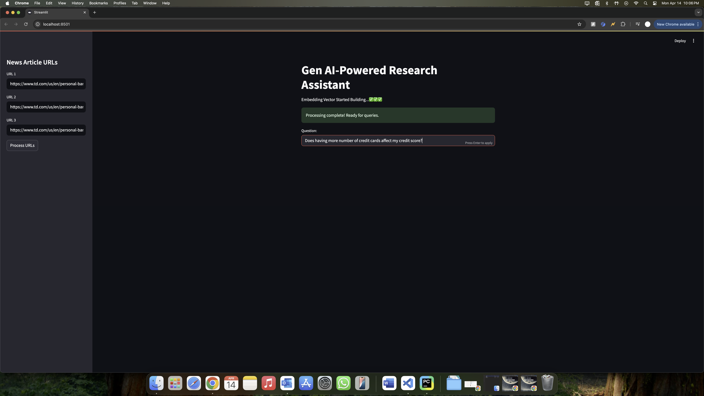
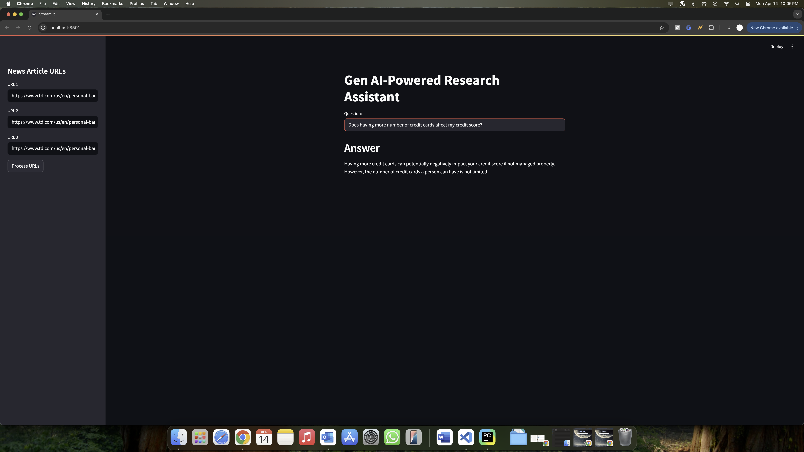

# 🧠 GenAI-Powered Research Assistant  
A smart, generative AI-driven tool that transforms web articles into concise, actionable insights through natural language interaction.

## 📸 Screenshots

  
  
  

## ✨ Features

- **Multi-URL Knowledge Ingestion**  
  Seamlessly process and analyze multiple article links in one go.

- **Advanced NLP Processing**  
  Uses LangChain’s intelligent document loaders for content chunking and preprocessing.

- **Semantic Retrieval at Scale**  
  Harnesses the power of FAISS for lightning-fast vector similarity search.

- **Contextual, Source-Aware Responses**  
  Answers include citations from the original content for traceability and transparency.

- **Persistent Knowledge Base**  
  Locally stores embeddings for ongoing reference and updates—build your own intelligent library.

## 🛠️ Technologies Used

| Category         | Technologies                                                                 |
|------------------|------------------------------------------------------------------------------|
| Core NLP & GenAI | OpenAI Embeddings, LangChain                                                 |
| Vector Search    | FAISS (Facebook AI Similarity Search)                                        |
| Article Parsing  | LangChain Document Loaders                                                   |
| Storage          | Local JSON/Vector Store                                                      |
| Language         | Python                                                                       |

## 🚀 Use Cases

- Rapid literature reviews and summaries  
- Context-aware Q&A over research articles  
- Personalized knowledge base creation  
- Extracting insights from news, blogs, and reports

